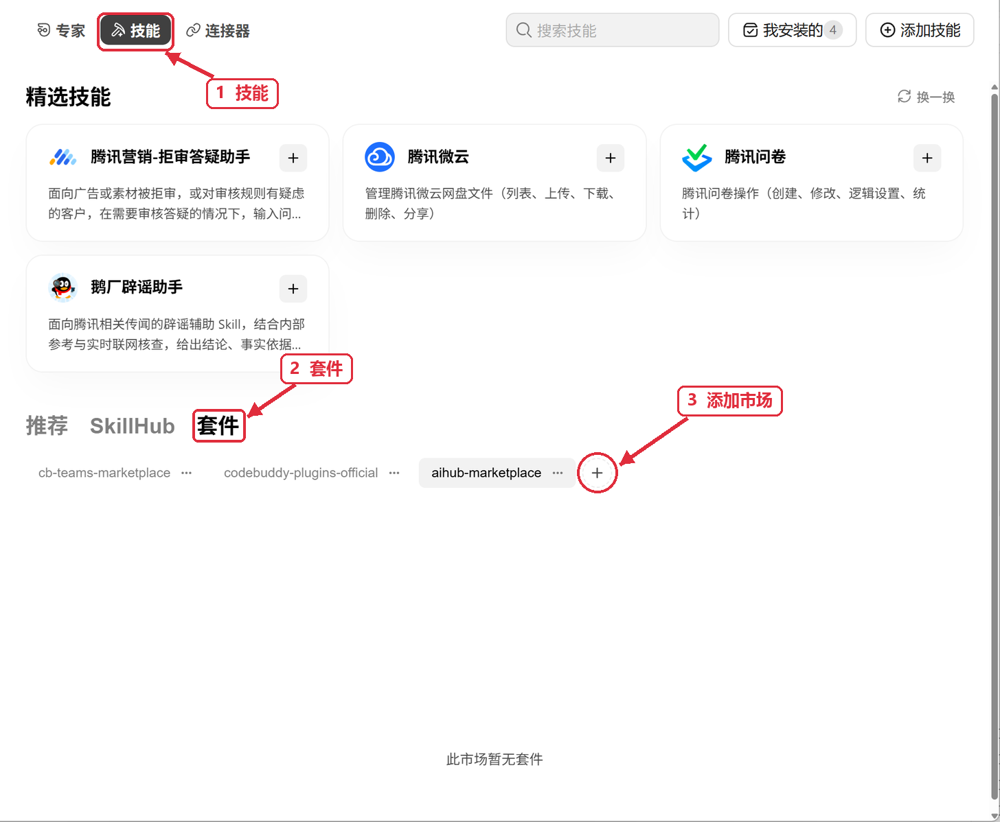

# AIhub Marketplace

这个市场提供两个完整的 Plugin，分别用于 AIhub 创作与文档处理、tikin 社交媒体数据与分析。你可以按需要安装其中一个或两个。

| Plugin | 能做什么 | 包含的 Skill |
| --- | --- | --- |
| [AIhub Studio](aihub-studio/README.md)（`aihub-studio`） | 图片、视频、音频、音乐、多模态理解、文档处理 | 6 个 `aihub-*` Skill |
| [tikin Social](tikin-social/README.md)（`tikin-social`） | 社交媒体数据查询、素材下载、账号与评论分析、趋势研究 | 17 个 `tikin-*` Skill |

仓库提供 Claude Code、Codex 和 WorkBuddy 的市场清单。清单登记不代表所有宿主与操作系统的完整调用都已验证；各 Plugin 的运行工具、配置要求与验证范围见其 README。

## 让 Agent 帮你安装

将下面这段话复制给正在使用的 Agent，把安装对象保留为你需要的 Plugin：

```text
请从 AIhub Marketplace 安装 aihub-studio 和 tikin-social：优先使用 https://github.com/cookaihq/aihub-marketplace，GitHub 网络故障时使用 https://cnb.cool/zhidateam/tannt/aihub-marketplace.git。先阅读仓库 README 和对应 Plugin 的 README，使用当前宿主的插件管理入口安装完整 Plugin，保留已有设置。在 WorkBuddy 中使用原生套件管理，不另起 CodeBuddy CLI；需要我操作界面时，请展示随包的入口截图。分别报告市场添加、Plugin 安装、Skill 发现与调用的结果。
```

在 WorkBuddy 中，打开 **专家·技能·连接器 → 顶部“技能” → “套件” → 市场名称一行右侧的圆形“＋”**，填入来源地址。添加后选择 `aihub-marketplace`，应能看到 **aihub-studio** 和 **tikin-social** 两张套件卡片，再通过对应卡片上的“＋”安装。



截图用于定位入口，其中的旧市场文字不代表新市场名称；本市场名称为 `aihub-marketplace`。“添加市场”是点击圆形“＋”后出现的窗口标题。详细操作及回复中展示图片的规则见 [WorkBuddy 安装说明](aihub-studio/references/workbuddy-install.md)。

Codex 与 Claude Code 使用各自的原生插件管理入口；让 Agent 按上面的提示词完成安装，并按对应 Plugin README 的支持范围验证。业务调用还需要对应服务的配置与权限。

## 从旧市场迁移

| 旧安装标识 | 新安装标识 | Plugin 全局配置目录 |
| --- | --- | --- |
| `aihub@plugin-marketplace` | `aihub-studio@aihub-marketplace` | `~/.config/aihub-studio/` |
| `tikin-plugin@plugin-marketplace` 或 `tikin-plugin@tikin-plugins` | `tikin-social@aihub-marketplace` | `~/.config/tikin-social/` |

Plugin 安装身份已经改变，现有安装不会自动变成新名称。请先读新 Plugin 的配置迁移说明，安装新版本并准备配置，再通过宿主入口停用旧 Plugin。开启新会话，确认 Plugin 身份和 Skill 来源指向新版本后再验证；验证成功后才卸载旧版。保留旧配置，只有你明确选择时才删除。六个 `aihub-*`、十七个 `tikin-*` Skill 名称及 `AIHUB_*`、`TIKIN_*` 配置字段保持原名。

旧 `~/.config/aihub/` 与 `~/.config/tikin/`（或原 tikin 的 XDG 配置位置）不会自动搬迁或作为旧别名继续读取。需要复用旧配置时，让 Agent 核对源文件、目标文件及已有设置，再按你的明确选择迁移；不要把密钥写进 Plugin 安装目录。项目配置及各 Skill 的普通配置回退规则见对应 README。

旧 `tikin-plugins` 转发市场固定在 `tikin-plugin` 0.3.0；新功能和维护版本在本市场的 `tikin-social` 发布。

## 版本与 Release

<!-- release-table:begin -->
| 目标 | 版本 | Release |
|---|---|---|
| aihub-studio | 1.1.0 | [aihub-studio/v1.1.0](https://github.com/cookaihq/aihub-marketplace/releases/tag/aihub-studio%2Fv1.1.0) |
| tikin-social | 1.1.0 | [tikin-social/v1.1.0](https://github.com/cookaihq/aihub-marketplace/releases/tag/tikin-social%2Fv1.1.0) |
<!-- release-table:end -->
